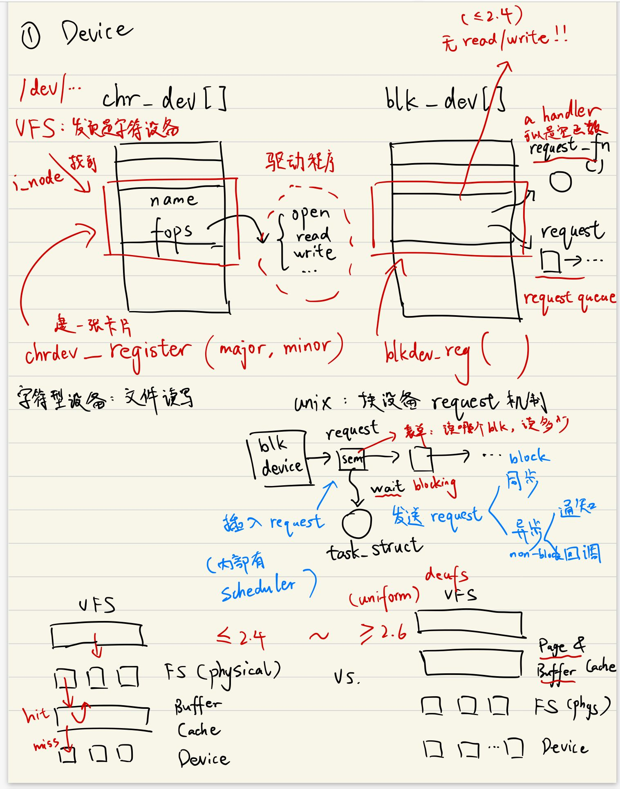
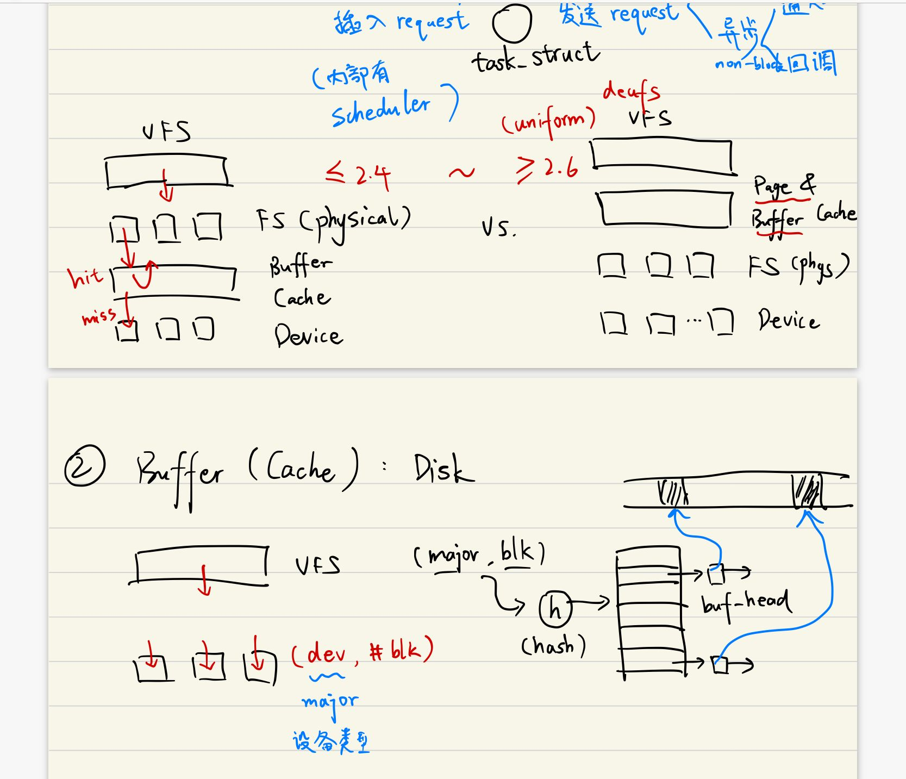
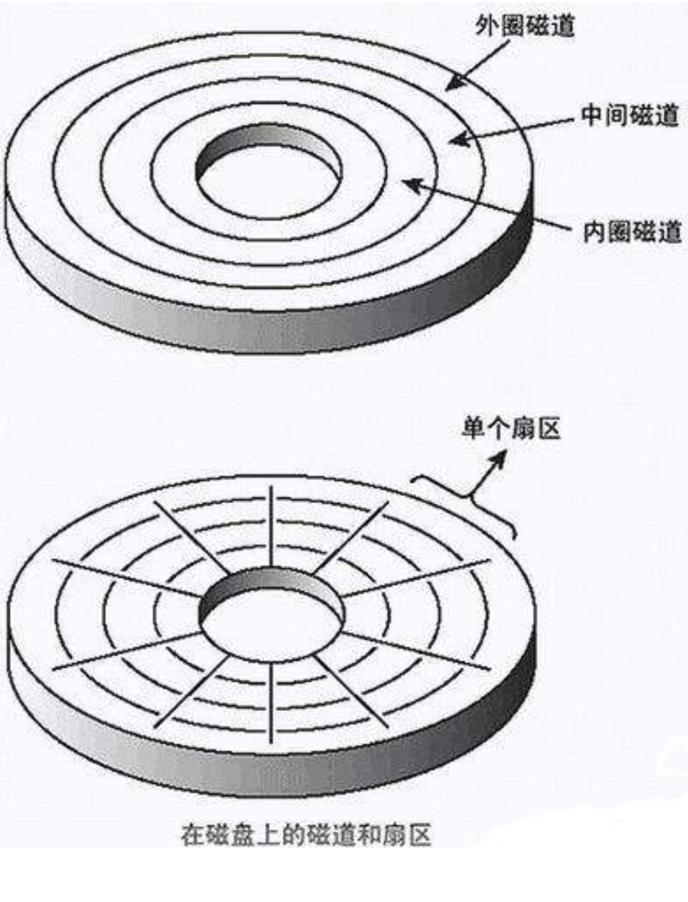
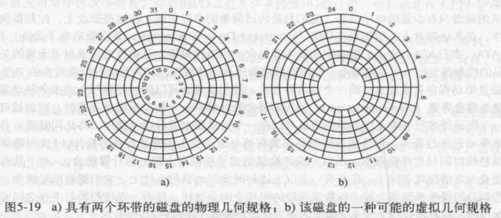
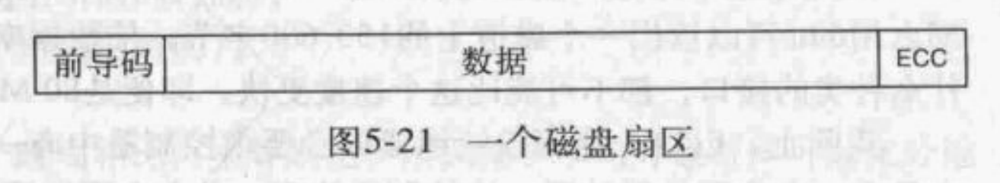

# OS Notes 4


## Review

### DMA

- CPU programs the DMA controller(发送需要IO内容所在的内存长度等等信息)
- DMA requests transfer to memory (DMA 向IO设备发送请求)
- Data transfer(把请求所需的内容从内存中拷贝)
- Acknowledge(IO设备告知DMA完成IO操作)
- Interrupt when done(把IO完成传到CPU 继续运行被打断的进程)


  ### 中断

  - 中断控制器（结构）
    一个中断先到达中断控制器(interrupt controller)，再告知CPU出现中断，再等待CPU确认中断，减少CPU因为中断而带来的负载。
  - 精确中断（定义）
    - PC 保存在一个已知位置 The PC saved in a known place
    - PC 前的指令都执行完了 All instructions before that pointed to by PC have fully executed.
    - PC 后的指令都不执行 No instruction beyond that pointed to by PC has been executed.
    - PC 指向的指令状态是已知的 Execution state of instruction pointed to by PC is known.

  

  ### I/O 目标

  - 设备独立 Device independence
  - 统一命名 Uniform naming
  - 错误处理 Error handling
  - 同步异步 Synchronous versus asynchronous
  - 使用缓冲 Buffer

  


  ### 三种 IO 方式

  - Programmed I/O
    通过CPU来进行所有的获取数据并且逐步发给IO设备，直到所有内容都完成一整个过程都占用了大量的CPU性能
  - Interrupt-Driven I/O
    利用中断，把内容发送给IO设备，在IO设备操作的同时可以进行其他进程的运行，直到IO设备操作完重新唤醒进程
  - I/O Using DMA
    只需要把IO内容的内存地址、大小等等信息传递给DMA，DMA进行内容的复制等等需要花费较多时间的操作，让其他进程有更多时间能够运行


## I/O Device

### 上课笔记




### IO 设备分类

- 字符型设备：数据为字符流，不支持随机访问（寻址）。
- 块设备：数据存储在固定大小的 block 上，传输最小单元是 block。支持随机访问。


### 字符型设备的 I/O

"万物皆文件"，字符型设备对外接口和文件一致：`open` , `read` , `write` ，这部分由驱动程序负责。

- 首先注册设备。

  ```
  chrdev_register(major, minor)
  ```

   `major / major number` 指的不同的设备种类。

   `minor / minor number`  指不同的设备分区。

  先在 `chr_dev[]` 表中建一张卡片（包含名字 `name`，文件操作 `fops` 等等），然后建立相应的 `i_node` 

  文件操作接口 `fops` 由驱动程序实现。

- 之后用户调用字符型设备的文件接口，首先交由 VFS。

  VFS 查询相应路径（`/dev/...`）、`i_node` ，发现其为字符型设备，找到 `chr_dev[]` 中的设备信息。

  调用卡片中的相应接口。


### 块设备的 I/O

主要针对 kernel 版本 `<= 2.4` 的一些细节。

重点：块设备内部不实现 `read/write` （存疑？），采用 `request` 机制完成 I/O 请求。

- 注册设备

  ```
  blkdev_register(major, minor)
  ```

  块设备的卡片中包含一个 `request_queue` 以及一个 `request_fn` （一个 `handler` 函数，可以为空，也可以是某种调度算法）

- `request_queue` 中的每个 `request` 记录了某个 I/O 请求（一个表单，读哪个块，读多少）。

  一个新的 I/O 请求进来，会根据调度算法插入 `request_queue`。

- 所执行的请求分为两种情况：
  - 同步（blocking），请求发起方会一直 wait 直到请求完成，得到返回值。
  - 异步（non-blocking），异步又有三种方式。
    - 状态：执行者执行到不同状态时发一个信号，发起者去查看是否完成。
    - 通知：request 完成后会通知发起方，发起方得到返回值。
    - 回调：和通知好像区别不大。一种实现方式。


## Buffer

### 原始定义

缓冲，是来自于（去往）设备方向的一个备份。


### Buffer V.S. Cache

- 纯粹的 Buffer：为了平衡两种速率不同的设备，中间接一个 Buffer 做缓冲。

- Cache：将常用的数据做一个备份。

- 磁盘：兼有 Buffer 和 Cache（Buffer Cache）。

  

### 上课笔记




在 `<= 2.4` 版本 Buffer Cache 的位置在 physical 的 FS 下，而在 `>= 2.6` 版本 Buffer Cache 在其上面（为了 uniform）。

并且 `>= 2.6` 版本还多了个 Page Cache。


### Buffer 结构

- VFS 的请求（[major, #blk]）会经过一个 hasher，用哈希值来 index 这个 buffer。
- hit 则直接返回给 BFS，miss 则需要访问 disk 设备。


### Cache 的种类

- Buffer Cache：I/O 设备的这个

- Page Cache：file system 里的那个
- Block Cache：体系结构里的 CPU 中的 Cache


### 一致性问题

- 同一个数据在两个 Cache 里都有备份：Consistence 问题

- Cache 和 Disk 的数据同步问题：Coherence 问题


## Stories

### Story：Alan Cox

- commonly regarded as being the "second in command" after Linus Torvalds himself
- maintained the 2.2 branch, and his own versions of the 2.4 branch (signified by an "ac" in the version, for example 2.4.13-ac1). This branch was very stable and contained bugfixes that went directly into the vendor kernels
- quit his role as the TTY layer maintainer, after disagreement with Torvalds

### Story：Richard Stallman

- launched the GNU Project
- founded the Free Software Foundation
- developed a number of pieces of widely used GNU software including, among others, the GNU Compiler Collection,GNU Debugger,and GNU Emacstext editor


## Disk

### 磁盘

  - **磁盘结构**：

    

  - **柱面**：抽象出来的概念，由多个同心同半径的磁道组成的

  - **扇区**：

    - 老式磁盘上每磁道扇区数相同，现代磁盘内外层扇区数不同
    - 从内侧环带到外侧环带，每个环带扇区数增加约 4%

    

  - **逻辑块寻址**：

    突破磁盘最大可能容量限制，磁盘扇区从 0 开始编号，无视磁盘的几何规格

### RAID
Redundant Array of Inexpensive Disk

最先是为了扩容，后来也发现具有纠错等数据安全性方面的功能。


### 磁盘格式化

  - 磁盘扇区结构

     

    - **前导码**：

      以一定的位模式开始，位模式使硬件得以识别扇区的开始，前导码还包含柱面与扇区号，以及某些其他信息

    - **ECC**（错误校正码）：域包含冗余信息，用来恢复读错误，一般的硬盘都有备用扇区，用来重映射坏扇区

  - 低级初始化：

    - 柱面斜进：当读完一个磁道后，去读下一个磁道，因为移动磁头需要时间，所以可以把下一个磁道的0号扇区后移几个，避免旋转一整周
    - 磁头斜进：与柱面斜进相似，但需要时间远小于一个扇区的时间

  - 磁盘臂调度算法：

    - **先来先服务算法**(FCFS)
      - 组织一个链表，把所有请求按照到达顺序组织起来，依次处理
      - 时间消耗较多
    - **最短寻道优先算法**(SSF)
      - 每次处理与当前磁头最近的请求
      - 请求分配不公，边缘请求有着更少的执行机会
    - **电梯算法**(elevator algorithm)
      - 维护一个方向位，每次处理完一个请求，检查方向位是UP还是DOWN，如果是UP，则上移处理更高位置的请求，如果没有更高位置的请求，则方向位取反，然后重复刚刚的操作。如果没有请求，就停在此处。

​	


## X Window System

### 概述

几乎所有 UNIX 系统的用户界面都以 X Window System 为基础，是一个非常复杂的图形化作业环境；可以将它分成3个部分，分别是**X Server**、**X Client**和**X Protocol** 。

### X Server

  - 主要负责处理输入输出的信息，并且维护字体、颜色等相关资源。它接收输入设备（如键盘、鼠标）的信息，将这些信息交给X Client处理，而X Client所传来的信息就由X Server负责输出到输出设备（如显示卡、荧幕）上
  - 相较于 **X Client** 而言总是位于用户的计箕机内部，X Server传给X Client的信息称作Events（事件），X Client 传给 X Serve r的信息称作 Request（请求）

### X Client

  - 主要负责应用程序的运算处理部分，它将X Server所传来的Events作运算处理后，再将结果以Request的方式去要求X Server显示在屏幕上的图形视窗

### X Protocol

- 为 X server 与 X client 之间通信的协议
- 支持现在常用的网络通信协议，若在同一台机器，则使用高效的操作系统内部通信协议

​	 

### 其它

Windows：RDP Protocol