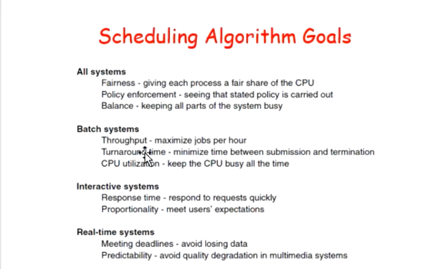
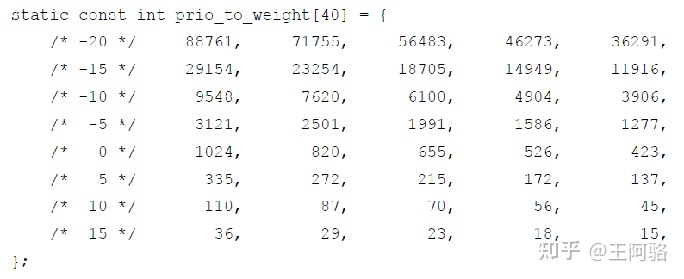

## CPU调度算法

+ 三类调度算法：
  + BATCH: 主要用于大型机
  
  + Interactive：个人电脑一般采用此类算法
  
  + Real time：主要用于控制系统
  
  
  
+ 调度算法的目标:

  

+ 调用Schedule的时刻：

  + 系统调用
  + 中断发生

+ 调用Schedule不代表一定发生调度

+ Scheduling in Batch System

  + First-Come First-Served（先来先服务）

    进程按照就绪的先后顺序使用CPU。

  + Shortest Job First（短作业优先）

    拥有最短完成时间的作业最先执行，是一个非抢占式的算法。

  + Shortest Remaining Time First（最短剩余时间优先）

    拥有最短剩余完成时间的作业最先执行，是短作业优先算法的抢占版。

  + Highest Response Ratio First（最高响应比优先）
  
    响应比最高的作业最先执行。其中响应比=周转时间/处理时间=(处理时间+等待时间)/处理时间=1+（等待时间、处理时间）

#### Unix采用的动态优先级多级反馈循环调度法（Round Robin With Multilevel Feedback）

+ 调度算法

1. 当一个时间片结束时，系统为所有进程计算优先级
2. 计算后查看是否有优先级高于当前进程且处于“内存就绪”的进程，将它们选出
3. 将选出的进程设置调度标志
4. 下一轮调度开始时，调度已设置了高优先级调度标志且优先级最高的进程，让其在处理器中开始运行

+ 优先数计算

​	根据优先数来判断进程调度优先级

+ 计算公式

​	p_pri = p_cpu / 2 + PUSER + p_nice + NZERO

- PUSER和NZERO是基本用户优先数的阈值，是系统预设的，分别是25和20

- 一个时间片结束后，系统将每个进程的p_cpu除以2，这个过程称为衰减。衰减过后，系统重新计算每个进程的p_pri

+ CFS调度算法（完全公平调度算法）

  Linux 内核V2.6.23，CFS成为默认的Linux调度算法。

  + CFS算法特点：

    1、采用平衡树即红黑树作为储存调度任务的数据结构；（公平性）

    2、每个树结点即一个调度任务，其在树中的key即vruntime（虚拟时间），vruntime越小，任务结点在红黑树中位置越靠左；

    3、每次调度树中最左边结点任务作为下一执行任务，时间复杂度为O(1)。

  + vruntime：

    1、vruntime += 实际运行时间（time process run）*1024/进程权重（load weight of this process）

    2、不需要使用实际系统时间，更短更有效；

    3、进程权重由nice值（友好度）索引而来，即事先为各个nice值分配权重（如下图所示); 

    ​		

    ​		可以看到1024即nice为0的时候所对应的权重，代码中定义为NICE_0_LOAD，nice值默认为0；

    ​		nice值越小其在vruntime增加越缓慢；

    ​		example: nice值为5的vruntime计算：vruntime += time process run * 1024/335

  + 

​		问题：调度算法中没有优先级会产生什么问题？CFS调度算法为什么“据说”可以没有优先级？

​	* A Lei: 二流选手写的东西不可能让所有人满意，个人感觉还是UNIX最好:)

+ 问题：UNIX最初的调度算法当进程被掉进内核便将其优先级升高，这样设计的理由是什么？

  回答：UNIX中进入必须在进入内核态的时候才能占用资源，这样设计主要是要让其占用资源时间尽快结束。（详细可参考课程回放）

+ 如果进程是交互的，优先级一定比普通进程高，但不会太高。进程使用磁盘优先级最高。如果频繁打断一个连续的I/O操作，整个系统性能一定会大幅下降。
