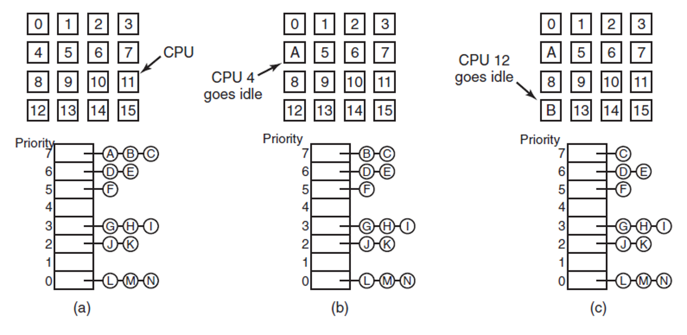
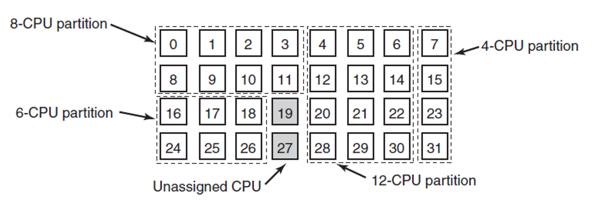
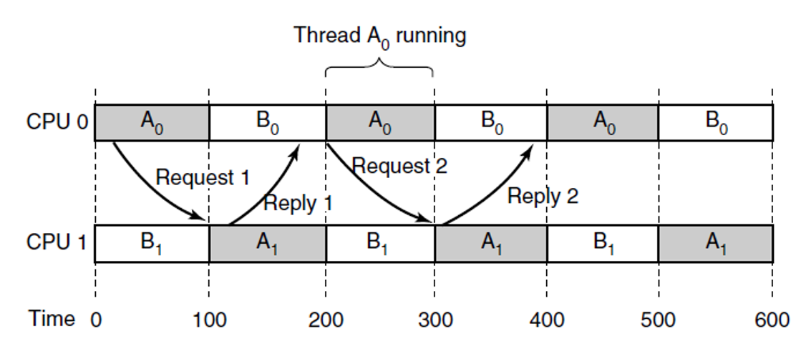
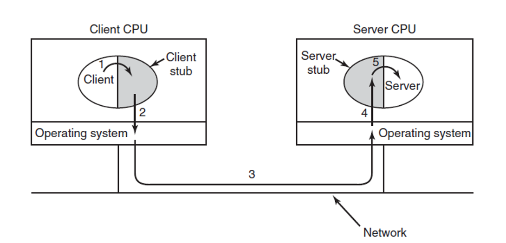
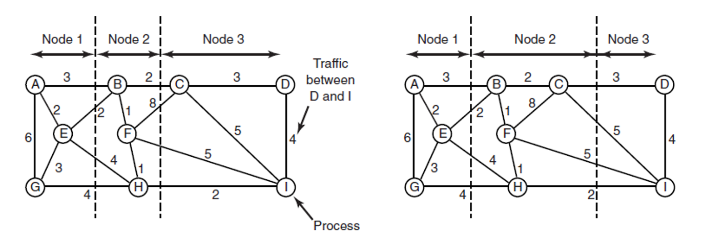

# 分布式系统

- crossbar switches：（交叉开关），每一个交叉节点均连接一个处理器与一个储存单元，通过节点的闭合与打开控制数据流方向
- UMA(uniform memory access)：（均匀访存模型），所有物理储存器被均匀共享，处理器访问的时间相同
- NUMA(non-uniform memory access)：每个处理器有自己的私有内存，提⾼了访问速度，但内存不统⼀  
  - 有一块对所有处理器可见的地址空间
  - 通过load与store指令访问非本地内存
  - 访问非本地内存要慢于本地访问


## 多处理器操作系统类型

不同的处理器运行着不⼀样的应⽤程序，需要不同的系统调⽤  

#### Each CPU Has Its Own Operating System

每个处理器都有独立的数据储存分区，但是共用同一份系统代码


#### Master-Slave Multiprocessors

由一个核心运行os，其余核心运行用户进程

关于全局变量与局部变量：

- 某个函数使⽤了全局变量，那么这个函数是不可重⼊(not re-entrant)的，不能同时有多个核⼼调⽤这个函数
- 多个函数使⽤了同⼀个全局变量、共享动态库也会造成这个问题  
- 某个函数只使⽤局部变量，那么可以这个函数可以被多个核心同时调⽤  

关于不可重入：可重⼊和内核态抢占的区别在于，内核态抢占在单核下对于多个进程也可以发⽣，可重⼊则是只有在多核状态下才会出现 


#### Symmetric Multiprocessors / Shared Memory Processor   

多个处理器共享内存与os


## Multiprocessor Synchronization

#### TSL(Test and Set Locking)

在同一条指令的执行中先后进行测试是否能上锁与测试成功直接上锁。该行为保证了运行的原子性，不会被打断，不容易出现同时上锁的情况。


这种策略主要针对单核情况，多核情况有其他的调度策略

## Multiprocessor Scheduling

#### Time Sharing



如同一个处理器多个核心一样，将任务安排在一个优先队列中，将队首的任务调度至空闲的处理器（处理器核心）。不同的用户共享处理器时间，因此被称为分时系统。

#### Space Sharing



os将进程与CPU分组，将固定的进程组分配给特定的CPU组。

#### gang scheduling



将进程分组，每组之间调度至特定的CPU组并行执行，组内的进程在CPU组上使用分时的结构调度同时运行。

>上图中的scheduling存在问题：
>
>* 需要等到a1醒了才能reply a0
>
>为了解决这个问题可以选用调度方式使得a0与a1同时运行：
>
>| time 0 | time 100 | time 200 | time 300 |
>| ------ | -------- | -------- | -------- |
>| a0     | b0       | a0       | b0       |
>| a1     | b1       | a1       | b1       |
>
>

## Remote Procedure Call

> 对象远程调用，包括
>
> * 本地过程调用
> * 远程过程调用



* Stub：负责接收请求寻找server并发送rpc请求
* CORBA/DCOM：
  * CORBA：通用对象请求架构
  * DCOM：分布式组件对象模型
* Common Object Request Bro
  * 对象请求代理，是一种在对象键建立client/server连接的中间件
  * 使得不同的OS使用不同的接口仍然可以通信
* Distributed Common Object Manager

## Graph-Theoretic Deterministic Algorithm



* 算法：
  * 寻找某种切割方式，使得切割到的边的总和最小
  * 边权代表着不同进程的通信量，切割到的边是在不同核心之间通信的代价
* 应用：
  * 只考虑通讯代价，不考虑负载均衡的任务到node的调度策略

## Buffer Overflow

#### example

```c
void getstr(char * y) {
  	while (true) {
      	if ((c = getchar()) == '\n') break;
      	*(y++) = c; // 在这里，如果过长，可能会改变栈里的ra
                    // 通过先输入一段二进制程序，然后改掉ra，就可以让系统跳转到自定义程序然后执行
    }
}
void foo() {
  	char y[10];
  	getstr(y); // 在这里输入超出10长度的字符串
}
```

