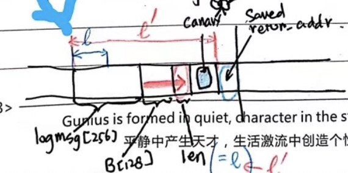

## Buffer overflow
- **Buffer**：缓冲区通常是在将数据从程序的一个部分转移到另一个部分或者在程序之间转移时，为保存数据而预留的内存区域。

- **Buffer overflow**：缓冲区溢出，是通过向缓冲区写入超过常规长度的数据，使得其从缓冲区溢出并覆盖相邻的内存区域的系统安全漏洞。

### Stack-based exploitation
上课时仅介绍了基于栈的缓冲区溢出攻击方式。

- **shellcode**：利用软件漏洞进行恶意攻击的代码通常称为 shellcode，虽然这段代码并不仅限于使用 shell 脚本编写，但这个名字已被广为接受。

- 通过在调用函数的参数中注入实施攻击的 shellcode，并将 stack frame 中的 return address 覆写为 shellcode 的起始地址。一旦函数返回，将在攻击者的 shellcode 处恢复程序执行。


#### Example
- 在 `gets` 中键入长度超过 128 的字符串，使得数据从缓冲区溢出，令攻击代码与其起始地址覆写 fp 和 ra。


### Protection

#### Canary
上课时仅介绍了 Stack Canary。

- Stack Canary：堆栈金丝雀（据 alei 称）因其类似于煤矿中的金丝雀用于检测瓦斯泄漏而得名，用于在 shellcode 执行之前检测堆栈缓冲区是否溢出。
  
- 工作原理：将一个随机整数放置在 ra 之前的内存中，由于大多数 buffer overflow 都是从较低的内存地址覆盖到较高的内存地址，所以为了覆盖 ra 从而控制进程，金丝雀值也必须被覆盖。在使用堆栈上的 ra 进行返回之前，金丝雀值会被检查是否改变，从而起到检验是否存在恶意修改的效果。


- 绕过金丝雀的方法：对于下方的代码，可以通过篡改 `len` 的值来跳过金丝雀，直接修改 ra 的值。 




#### DEP & ASLR

- Data Execution Prevention (书中 p645）：禁止某些内存区（如堆栈）被执行。
  
- Address Space Layout Randomisation（书中 p647）：在内存区中并不按顺序分配内存，而是进行随机分配。

- 这两种技术的结合可以使得使用 shellcode 和 ROP（return-oriented programming）来利用系统漏洞进行攻击变得异常困难。
  
- 但攻击者仍然可以通过修改 ra，不断跳转到 libc 动态链接库，尝试组合其中的库函数用类似于宏编程的方式来进行攻击。

## Format string attack
- 格式化字符串漏洞多数来自于编程者的偷懒。比如当想要打印一个字符串时，本应该写成`printf("%s", str);`的语句，却因为偷懒而写成 `printf(str);`，就会导致这样一个漏洞。

### Example 1

```c
printf("Hello World %s");
```

- 上方的代码将会认为 `printf` 实际上传入了两个参数，从而使得 `printf` 从堆栈中接下来的位置读取数据并打印到屏幕上，从而导致严重的安全问题。

### Example 2

```c
printf("Hello%n");
```

- `%n` 会将已经打印出的字符长度输出到指定的地址之下，上方的代码将把 5 写到堆栈中。通过类似的方式可以做到将任意的值写到内存中任意地址，从而实现攻击。若是需要输出的数字过大，则可以分多次进行写入。