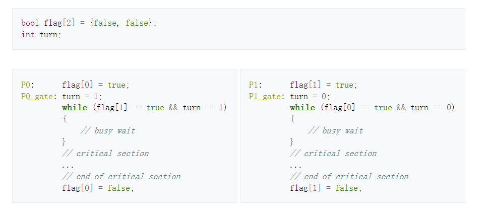

# Deadlock

## Review

**Race Condition**：两到三个线程或进程访问同一块共享空间并同时修改它。最终对于这块数据的修改取决于系统调度算法。

**Critical Region**：程序中访问共享资源的部分，需要保证同时最多被一个进程执行。

**Busy waiting & Sleep wakeup**

* Busy waiting: spin lock
  * 实现：关闭中断、TSL指令保证atomic、严格有序（击鼓传花），Peterson‘s
  * 缺点：浪费CPU cycle（一直尝试）
* Sleep wakeup: waiting的进程进入sleep。例子：信号量

**Peterson’s solution**

* cases for 2 processes

ps: turn不需要加锁，因为同一时刻turn一定只有一个固定的值，不影响互斥

* cases for more than 2 processes: [Filter algorithm: Peterson's algorithm for more than two processes](https://en.wikipedia.org/wiki/Peterson%27s_algorithm#cite_note-Silberschatz.p194-3)

n-1道门，每次拦住一个进程，最终放一个进入critical region

**TSL**：优先级高的程序在busy waiting状态拿不到block。

**权利互换**：权力最高的work永远在执行且该work无法完成造成死锁

* 权利最高的work优先级逐步下降
* work不完成进入sleep，直到可完成时被wake up。

 ## Wake-up lost problem

生产者：做满item后进程进入sleep，直到buffer空唤醒消费者

消费者：buffer空时进入sleep，直到buffer满了唤醒生产者，自己开始消费buffer。

### 问题场景例举

生产者生产满N个item，在进入sleep之前，正好调度器运行消费者，在消费掉1个item之后判断还剩N-1个item，于是认为生产者处于sleep，并wake-up（此时生产者实际处于wake状态，状态没有改变）。调度器在调度生产者的时候，生产者真正进入sleep。消费者不断消费，直到所有item被消费，生产者和消费者都将进入永久sleep，出现矛盾。

### 解决方法

使用信号量(Semaphores)

 ## Semaphores 信号量

一个信号量可以拥有的值是$0$和任意的正整数

### **关于信号量的操作**

**down** : 如果信号量的值大于0，则使得信号量减一； 如果信号量的值为0，则此时的进程被休眠且并没有完成down操作。
**up** : 使得信号量的值加1。 如果此前有一个或多个进程因为此信号量而休眠了，系统将选择其中之一将其唤醒并让其完成**down**操作
**注**： **down**和**up**操作都是不可分的原子操作。

### **用信号量解决Producer-Consumer Problem**

使用信号量时，将访问用于计数的变量和唤醒别的进程（或将自己睡眠）这两个过程合为一个原子操作了，防止在访问用于计数的变量后由于调度器调度导致还未执行唤醒别的进程（或将自己睡眠）就先去执行另一个进程而再次访问计数的变量最终导致producer和consumer永久休眠的情况。

## Monitors 管程

管程是一系列程序，变量，数据结构的集合。进程可以调用管程中的程序，但不能通过在管程之外定义的程序直接访问管程内部的数据结构。

### 管程的性质

管程中的程序一次只能被一个进程调用。进程在调用管程中的程序时，管程中的程序会先检查是否有其他进程调用了管程中的程序，若有则让这次调用进入等待。
管程的这一性质可以被用于实现互斥