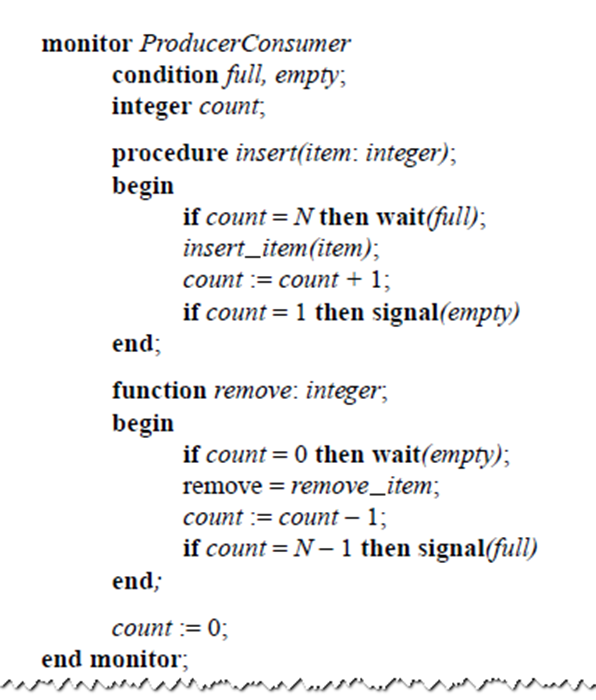
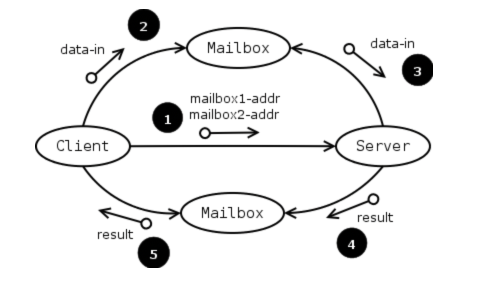
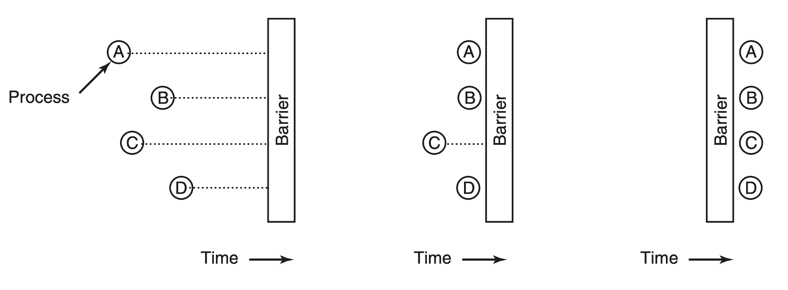

###### 2022/4/28 Monitor & Message passing & Barrier & RCU 

# Monitors 管程

#### monitor提出背景

* 使用`emaphore`和`mutex`时在一定情况下由于细微问题很容易出现死锁等问题
* 在**语言级**规范化，基于语言级能够用文法实现的形式化，使得能够更容易编出正确的程序（但目前没有具体语言支持）

#### monitor 

* 是一种程序结构，结构内的多个子程序（对象或模块）形成的多个工作线程互斥访问共享资源
* **语言级 **
  * 区别于 锁`mutex`、信号量`semaphore`、原子指令、p_thread_XXX等，为系统结构级、操作系统级、库级等

* 便于实现互斥共享：通过限制在任何时候，monitor中最多只有一个活跃的进程。（主要原理和特性）

  * 最多只有一个活跃的进程：任何进程都能执行monitor中的函数，但在任一特定时刻只有一个进程在执行

  * 可以存在其他睡眠状态的进程，能被`signal()`唤醒：某一进程进入monitor后发现不满足执行条件在里面进入睡眠状态，可见幻灯片`Chapter02-Processes and Threads`第`48`页monitor的例子
   

#### signal(full)执行时，两个进程同时处于活跃状态的问题

* 具体问题：一个进程发出`signal(full)`，当`signal(full)`执行完后，另一个进程被唤醒，刚发出信号的进程也仍处于活跃状态，从而有两个活跃进程的状况违背了monitor最多只有一个活跃进程的原则。
* 解决方案：
  * **Per Brinch Hansen**的方案：允许一段时刻同时有两个进程短暂活跃，在进行完唤醒过程后第一个进程迅速退出
  * **CAR Hoare**的方案：暂时suspend，移交给其他（如调度器、系统）来处理，在monitor外发生wake-up

# Message passing

消息传递是一种进程间通信的方式，使用两个原语：send 和 receive。

消息传递主要分为两种：

- 同步消息传递：发生在同时运行的对象之间。类似于同步函数调用，发送进程需要一直等接收进程完成。

 由于等待，某些应用程序无法进行同步通信。

- 异步消息传递：当请求对象发送消息时，接收对象可能处于关闭或忙碌状态。此时异步消息传递就像一个立即返回的函数调用，无需等待被调用函数完成。消息被发送到存储它们的队列，直到接收进程请求它们。

	异步通信所需的缓冲区存满后可能会导致问题，必须决定是阻止发送者还是丢弃未来的消息。被阻止的发送者可能会导致死锁。如果消息被丢弃，通信就不再可靠。
	
### Mailbox

对于消息如何寻址，一种方法是为每个进程分配一个惟一的地址，并将消息发送给进程。另一种是用一个叫邮箱的数据结构。

# Barrier

对于多个线程或进程间的同步，可以使用barrier。

屏障有多种实现方式：

- 最基础的屏障主要有两个变量，一个记录屏障的通过/停止状态，另一个保存已进入屏障的线程总数。

- 顺序屏障使用相反值来表示通过/停止的状态。比如，如果障碍1使用0来停止线程，障碍2就使用1来停止线程，障碍3再次使用0来停止线程，以此类推。

- 组合树屏障以分层的形式来实现屏障，通过避免所有线程在同一位置旋转的情况来解决可伸缩性问题，也就是最基础的屏障会有的问题。

	在 k-Tree Barrier 中，所有线程均等地划分为 k 个线程的子组，并在这些子组内完成第一轮同步。一旦所有子组完成同步，每个子组中的第一个线程进入第二级进行进一步同步。依此类推。最终只剩下一个组需要同步。最后一级同步后，释放信号向上层传递，所有线程都通过屏障。
	
- 屏障也可以是高级编程语言语句，可防止编译器在优化过程中对屏障语句上的其他操作重新排序。此类语句可能会生成处理器屏障指令。

- 屏障也可以通过硬件来实现。

# RCU (read-copy-update)

有些情况下我们能保证数据的读入和更新同时完成而不出错，以此避免锁的使用。比如对于链表，经过以下步骤来同时进行读取该结构与线程复制同时读取以进行更新。

- 插入节点（在父节点A和子节点E之间）：

	- 创建新节点X
	
	- X的指针指向E
	
	- A指向E的指针更新为指向X
	
	此时读到E的读者继续读旧版本，读到A的读者读的是新版本。
	
	删除节点的情形类似。

###### Edited by Mzi, daidai01

