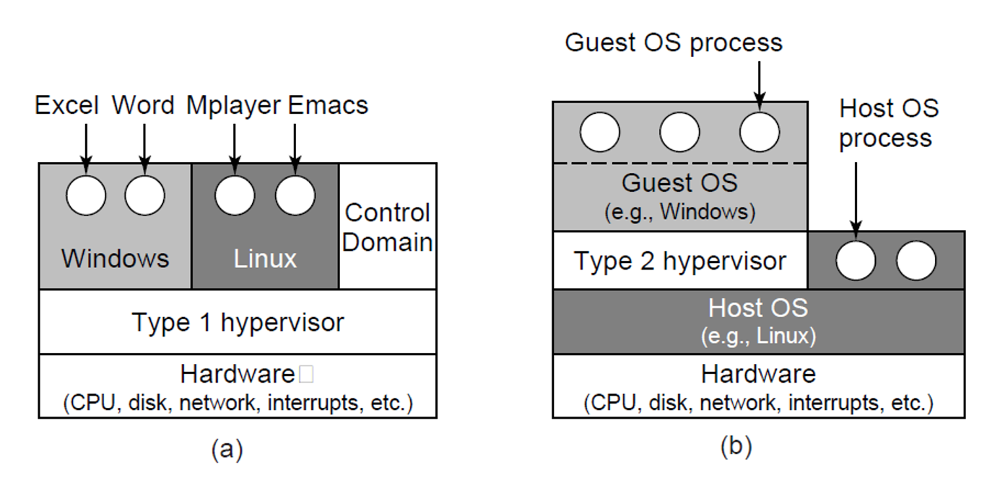
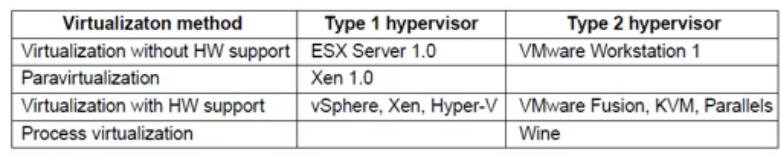

## Topic 1 Scheduling in Interactive Systems

- 动机：系统内资源有限，需要实现
   - 公平性
   - 充分利用资源
- 对象：网络、CPU、磁盘等

### Method

- Round-Robin Scheduling：维护一个队列，一直跑队首，队首进程跑完其被分配的时间片就将其放到队尾。不会有进程跑不到。
- MLFQ
   - 多个队列，有优先级
   - 权值，越小越高：
      - 权值=CPU时间/2+base（内核或用户进程）+nice
      - 进程在CPU上跑的时间多->权值较高->优先级下降
   - 循环地跑优先级最高的那个队列，通过优先级下降机制来让所有进程都能跑到。
- 彩票调度Lottery Scheduling
   -  随机抽奖
   -  高权重的进程有更多的值，抽到每个都代表该进程
- Multiple Queues
- Shortest Process Next
- Guaranteed Scheduling
- Fair-Share Scheduling

### 实时系统
- 硬实时：能够在指定的期限完成实时任务（最坏时间）严格实时
- 软实时：在平均情况下能支持任务的执行期限（平均时间）超时给予补偿
-  周期性任务：使用定时器
-  非周期性：跟着其他任务执行、任务自己定时
-  问题：定时器需要额外资源
-  最终要求：
	- $\sum \frac{C_i}{P_i} \le 1$.
	- P表示调度时间间隔，C表示一次运行时间

## Topic 2 Virtualization & Cloud

- Host OS(VM) & Guest OS
- Hypervisor
   - 满足一个机器上运行多个系统的要求：加入Hypervisor中间层
- 虚拟化的要求
   - 安全：hypervisor控制所有物理系统资源
   - 保真：在硬件上和vm上运行效果相同
      - 问题
         - sensitive instructions: 做I/O，改变MMU的状态的指令
         - privileged instructions: 在用户态执行会导致trap的指令
            - eg 早期Intel 386上vmware会一直在用户态，导致POPF并不改变某个允许/不允许中断的位（内核态时才会改变），就无法做到保真 解决方法trap-and-emulate
      - para-virtualization vs full virtualization
         - full-virtualization: 完全模拟，虚拟机好像运行在原生硬件上。
         - para-virtualization: 并不准备完全模拟，而是让虚拟机寄生在hypervisor上，可能使用hypervisor的接口(hypercalls) 在guest os的源代码级做修改。
   - 效率：
      - 解释式执行：慢
      - 解决：
         - DBT：动态二进制翻译，以basic block为单位，开销1.5倍左右
         - EL：execute level翻译，整体翻译，如将x86翻译为IA64
         - cache: 一次翻译，多次使用
- Type 1 and 2 Hypervisors
	  
	
	- Type1: 所有系统运行在hypervisor上（系统级虚拟化）
      - 需要control domain：大多使用QEMU
      - 例子：Xen
   - Type2：虚拟机运行在OS上（用户级虚拟化）
      - 例子：VMWare，KVM
- Shadow page table
   - Ballon Algorithm（下节课）